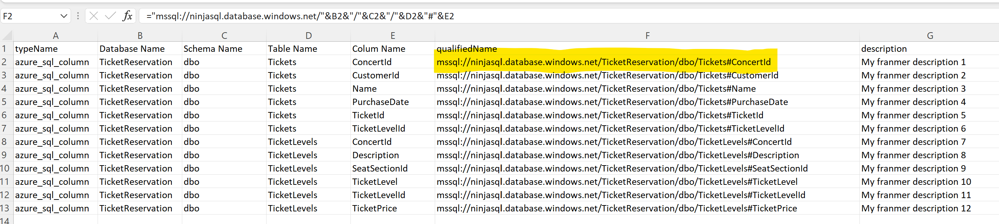
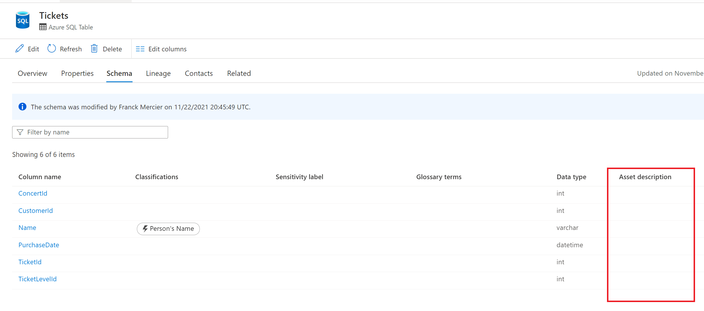
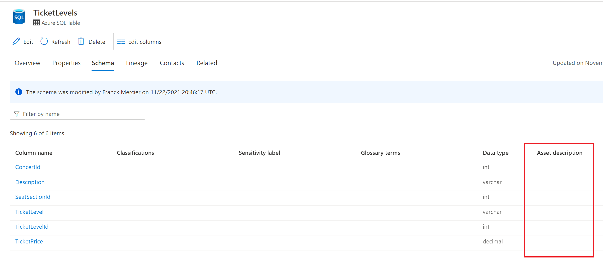
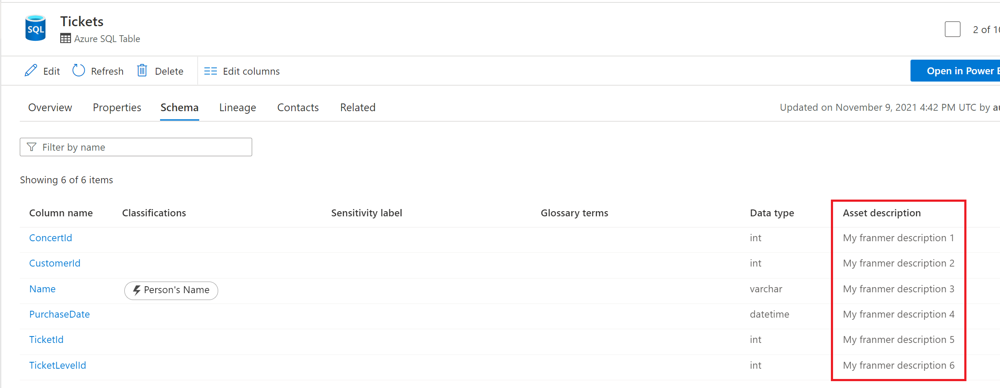
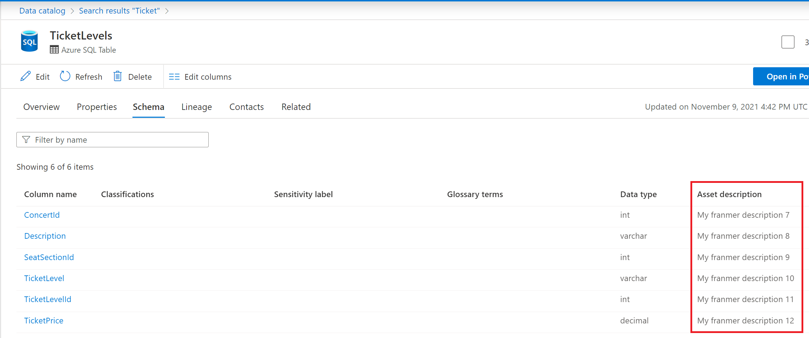

Une demande qui revient de temps en temps avec Azure Purview, est la possibilité de mettre à jour les propriétés des assets à partir d'un existant comme un fichier Excel.

Dans cet article, je vais illustrer une manière possible pour répondre à ce besoin en utilisant les API Azure Purview. Au passage, Merci à Will Jonhson pour son aide !

## Description du scénario

Ici, nous avons un fichier Excel qui contient les descriptions des colonnes de nos tables SQL. Vous noterez que la valeur de la colonne **"qualifiedName"** est le résultat d'une formule. Cela peut avoir de l'importance, plus tard, dans le code python.



Du côté d'Azure Purview, les scans ont été fait et nous avons les assets correspondants.

Ci-dessous, un exemple avec 2 assets. Le but étant de mettre à jour automatiquement le champ **"Asset description"** pour les 2 assets :




## Prerequis

Afin de pouvoir exécuter le script, il sera nécessaire :

- D'enregistrer une [application dans Azure Active Directory (AAD)](https://docs.microsoft.com/en-us/azure/active-directory/develop/quickstart-register-app)
- Ajouter cette application en tant que **"Data Curator"** au niveau de la collection **"Root"**. Plus de détails [ici](https://docs.microsoft.com/en-us/azure/purview/catalog-permissions)
- Visual Studio Code (ou un autre éditeur de code)


## Le script

Dans mon exemple, le fichier Excel se trouve sur mon disque dur local : "C:\Temp\Purview\Excel\ColumnDesc_Rich.xlsx".

Comme expliqué plus haut, mon fichier Excel contient une colonne dont le résultat provient d'une formule de calcul. Si l'on ne désire récupérer que la valeur de la cellule, et non la formule, il faut utiliser l'argument **"data_only=True"**. Sinon, sans cet argument, c'est la formule elle-même qui sera retournée.

Copiez puis collez le script ci-dessous dans votre éditeur de code. 
Complétez le code avec les informations de votre compte Azure Purview et de votre application AAD :


 :

```Javascript
import openpyxl
from pyapacheatlas.readers import ExcelConfiguration, ExcelReader
import json
import os
from pyapacheatlas.auth import ServicePrincipalAuthentication
from pyapacheatlas.core import PurviewClient, AtlasEntity, AtlasProcess
from pyapacheatlas.core.util import GuidTracker
if __name__ == "__main__":
    purview_Account_Name = "<YourAzurePurviewAccountName>"
    oauth = ServicePrincipalAuthentication(
    client_id="<Your Client ID>",
    tenant_id="<Your Tenant ID>",    
    client_secret="<Your Secret>"
    )
    client = PurviewClient(
        account_name=purview_Account_Name,
        authentication=oauth
    )
ec = ExcelConfiguration() 
reader = ExcelReader(ec)
wb = openpyxl.load_workbook('C:\Temp\Purview\Excel\ColumnDesc_Rich.xlsx',data_only=True)
sheet = wb['Sheet1']
rows = reader._parse_spreadsheet(sheet)
for row in rows:
    client.partial_update_entity(
        typeName=row["typeName"],
        qualifiedName=row["qualifiedName"],
        attributes={
            "description":row["description"]
        }
    )
```

Après exécution du script, vous devriez voir vos assets Azure Purview mis à jour avec les valeurs provennant du fichier Excel comme illustré ci-dessous :





